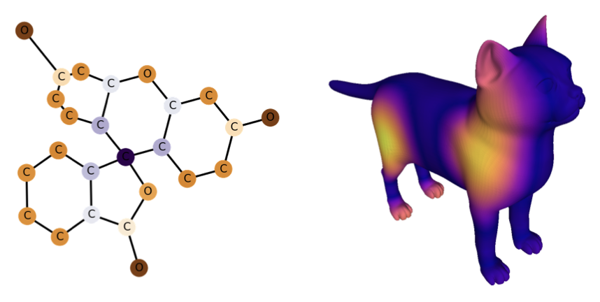
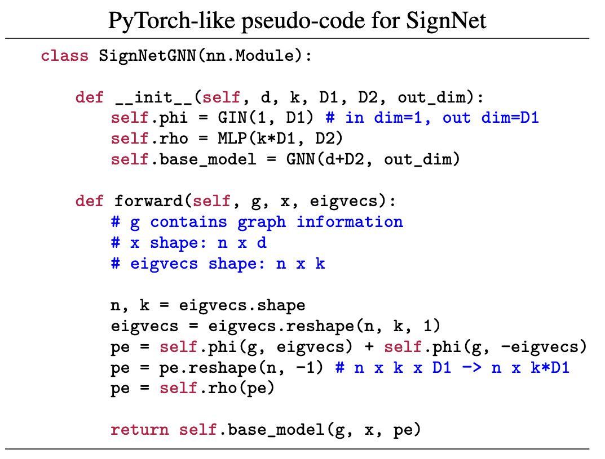
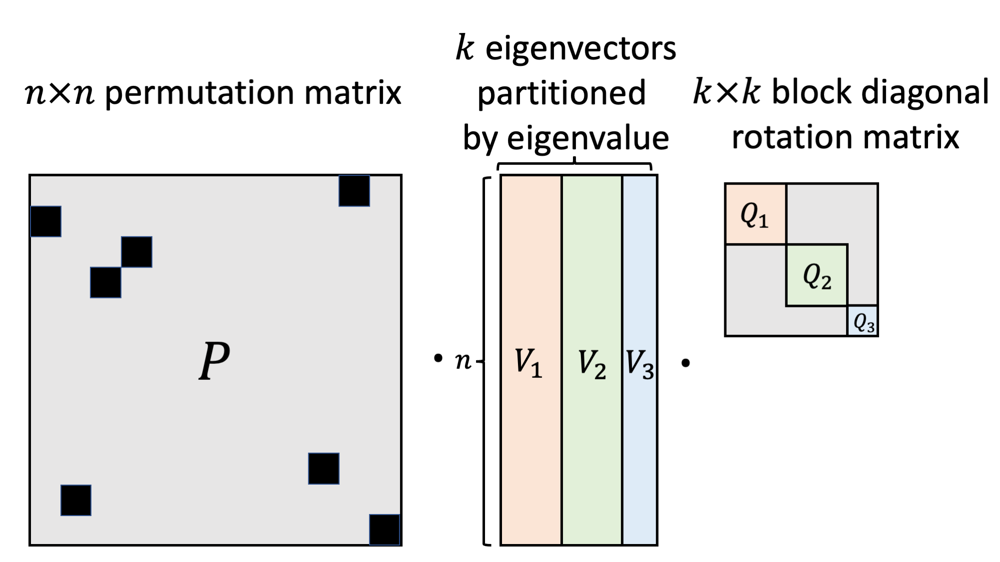

# Sign and Basis Invariant Networks for Spectral Graph Representation Learning
By Derek Lim*, Joshua Robinson*, Lingxiao Zhao, Tess Smidt, Suvrit Sra, Haggai Maron, Stefanie Jegelka.  
[[arXiv](https://arxiv.org/abs/2202.13013)] [[pdf](https://arxiv.org/pdf/2202.13013.pdf)]

Codebase for neural networks (SignNet and BasisNet) and experiments in the paper.

## Experiments

`Alchemy` contains the experiments for graph-level regression on Alchemy.

`GraphPrediction` contains the experiments for graph-level regression on ZINC.

`LearningFilters` contains the spectral graph convolution experiments.

The intrinsic neural fields experiments use private code from the authors of the [original paper](https://arxiv.org/abs/2203.07967), so we do not yet publically release the SignNet codes for these.

## Implementations

PyTorch Geometric SignNet for graph prediction: in `Alchemy`.

DGL SignNet for graph prediction: in `GraphPrediction`.

BasisNet for single graphs: in `LearningFilters`.

The SignNet architecture is rather simple. Here is an example of pseudo-code for SignNet, as used for graph prediction tasks with a GNN base model:  

**Coming Soon:** More experiments and implementations of our models! This repo and our paper are still a work in progress.

